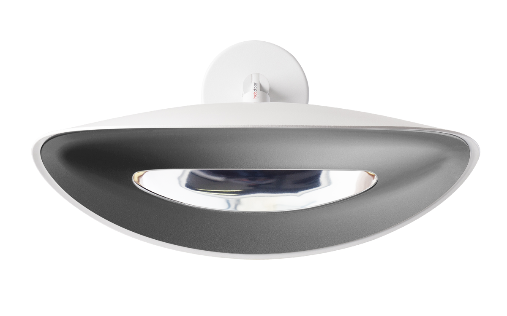
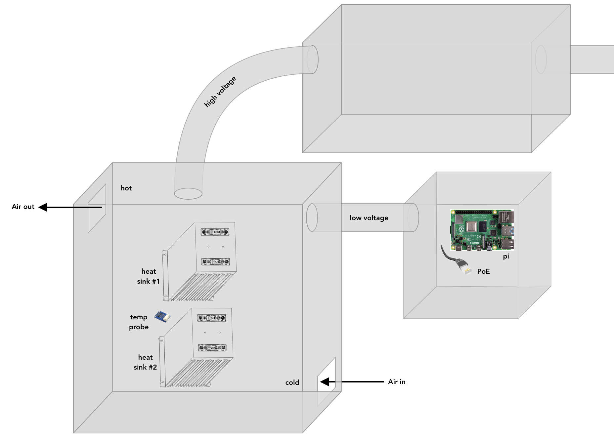
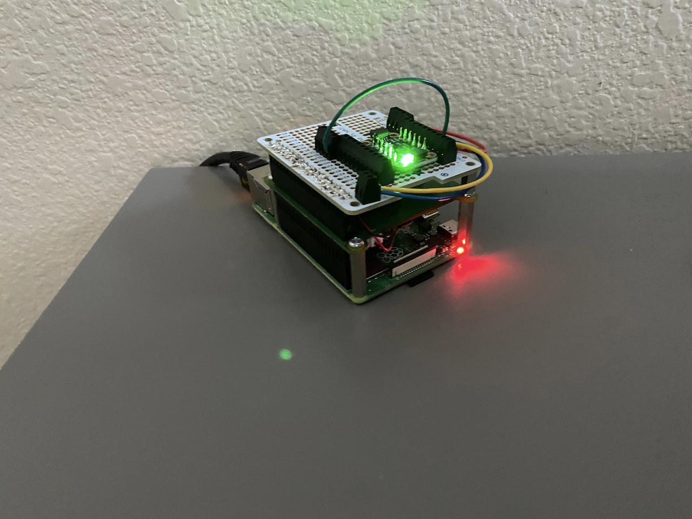
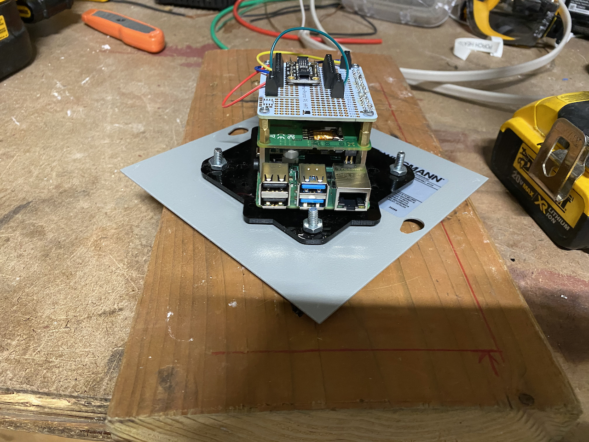
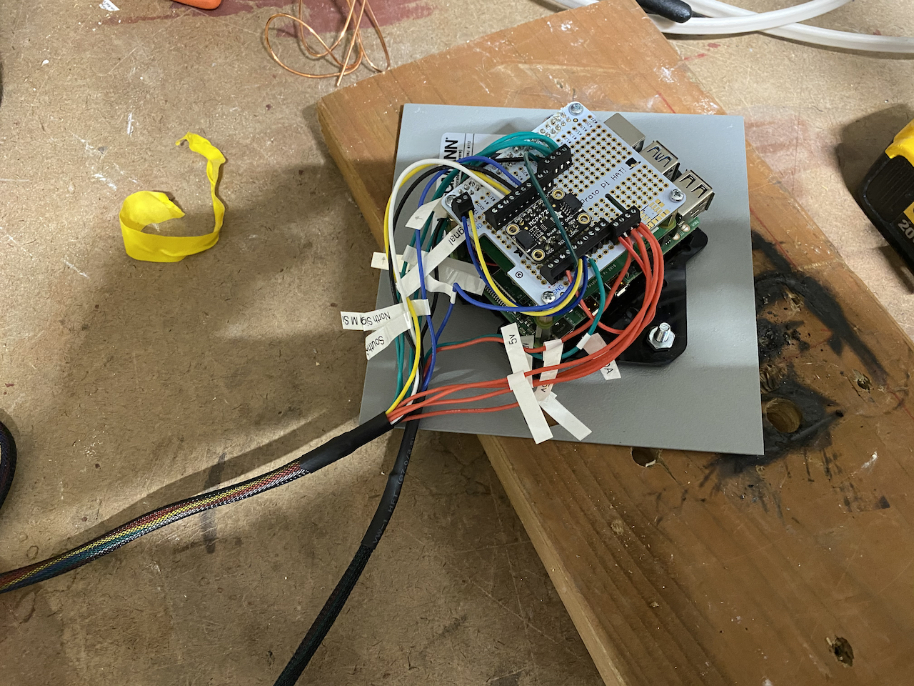
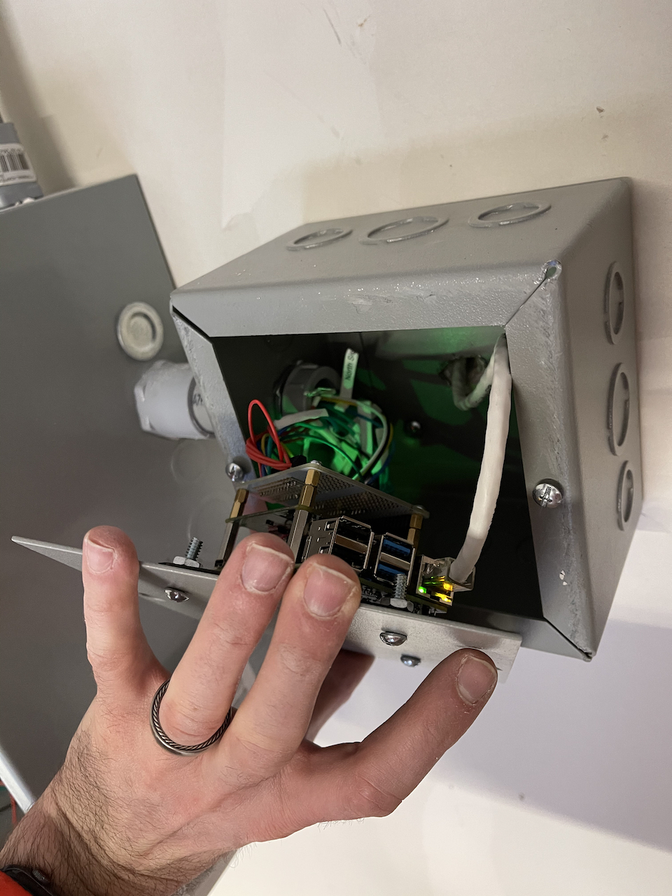
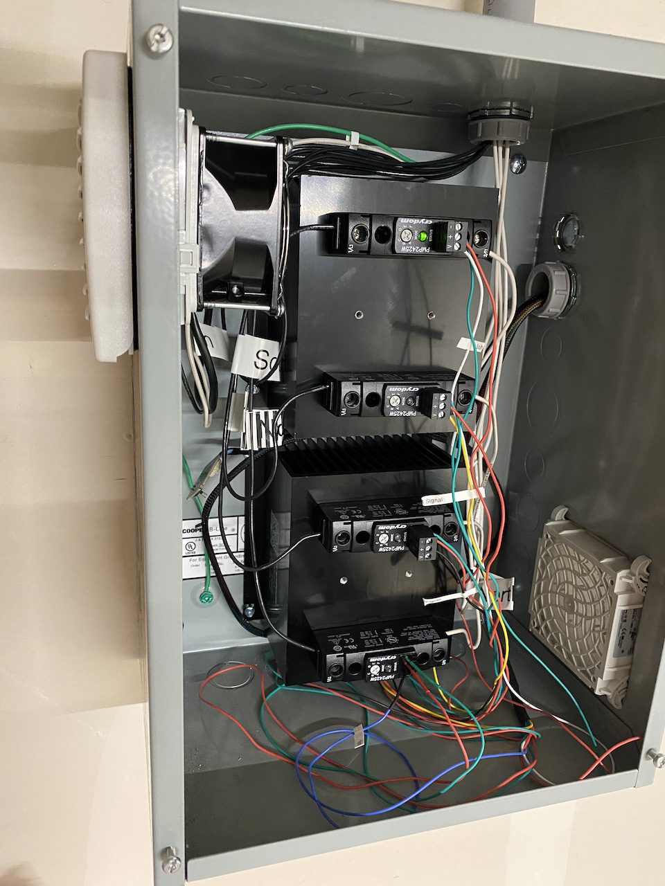

[Install Homebridge]: https://github.com/nfarina/homebridge#installation
[Configuration]: #Configuration

# Homebridge-PhormalabDimmer

[Homebridge](https://homebridge.io) accessory plugin for [Phormalab infrared lamps](https://www.phormalab.it) that are connected to an I²C-capable device like a [Raspberry Pi](https://www.raspberrypi.org) connected to an [I²C-compatible MCP4728 DAC](https://www.adafruit.com/product/4470). This in turn, will provide input into a [proportional output solid state relay](http://www.crydom.com/en/products/control-relays/pmp-series/). If you wanted to repurpose the code here to run dimmable/proportional output from the MCP4728, should be easy to do. Code only allows for 4 devices.

[](https://npmjs.org/package/homebridge-phormalabdimmer)

[](https://www.phormalab.it)

# Features
* Control the infrared heat output from a lamp via HomeKit dimmer function
* Setup automations in [HomeKit](https://www.apple.com/ios/home/)
* Ask [Siri](https://support.apple.com/siri) to control your devices

# Setup / Installation
1. [Install Homebridge]
2. `npm install homebridge-phormalabdimmer`
3. Edit `config.json` and configure accessory. See [Configuration](#configuration) section.
4. Start Homebridge

# Configuration

To configure the plugin, add the following to the accessories section in `config.json` of Homebridge. The `i2c_address` is assumed to be default for MCP4728 (`0x60`) on the default I²C bus (`/dev/i2c-1`). If you need to specify a different address or bus, use `"i2c_address": "0x.."` and `"i2c_device": "/dev/i2c-.."`. The `lamp_names` are assumed to be in same order as corresponding MCP4728 output connections (0–3 or labeled A–D on some boards).

```json
    "platforms": [
        {
            "name": "Phormalab Dimmer",
            "platform": "PhormalabDimmer",
            "lamp_names": [
                "Phormalab South",
                "Phormalab South Middle",
                "Phormalab North Middle",
                "Phormalab North"
            ]
        }
    ]
```

# Help
If you have any questions or help please open an issue on the GitHub project page.

# Setup photos







# Build list
If you are interested in building something similar, here is a link to all the various items I used to build. This was a fun project.

* (1) [Raspberry Pi 4b+](https://www.adafruit.com/product/4296)
* (1) [Tall 2✕20 and 2✕2 stacking headers for Pi](https://www.pishop.us/product/4-40-pin-extra-tall-header-push-fit-version-poe-hat-set/)
  * This allows you to use PoE hat + have 2✕20 pins pass through for use by PermaProto HAT below (requires soldering)
* (1) [Raspberry Pi PoE Hat](https://www.adafruit.com/product/3953)
* (1) [Adafruit PermaProto HAT](https://www.adafruit.com/product/2310)
* (2) [10-pin terminal blocks](https://www.adafruit.com/product/2142)
* (2) [4-pin terminal blocks](https://www.adafruit.com/product/2137)
* (1) [2-pin terminal block](https://www.adafruit.com/product/2138)
* (1) [MCP4728 DAC with 4✕0-5v outputs](https://www.adafruit.com/product/4470)
* (1) [C4 Labs Zebra VESA Pi Mount](https://www.amazon.com/gp/product/B011JAC3UO/ref=ppx_yo_dt_b_search_asin_title?ie=UTF8&psc=1)
  * Drilled holes in cover of the Wiegmann enclosure to mount inside.
  * Excess low-voltage wiring added to allow for easy access when opened
* (1) [M2.5 Hex Standoff Kit](https://www.amazon.com/gp/product/B072N84VM3/ref=ppx_yo_dt_b_search_asin_title?ie=UTF8&psc=1)
* (4) [Crydom PMP2425W Solid State Proportional Relay](https://www.galco.com/buy/Crydom/PMP2425W)
* (2) [Crydom HS053 Heat Sink for SSRs](https://www.masterelectronics.com/crydom/hs053-45159069.html)
  * Orient fins vertically to allow for appropriate air flow
* (4) [Crydom HK8 Mounting kit for PM22 Series SSRs](https://www.galco.com/buy/Crydom/HK8?type=ac_search)
* (4) [Crydom HSP-7 Thermal Pad for PM22 Series SSRs](https://www.galco.com/buy/Crydom/HSP-7?type=ac_search)
* (1) [McMaster-Carr 16" ✕ 12" ✕ 8" Enclosure](https://www.mcmaster.com/catalog/75065K42)
  * Place heat sinks + solid state relays + temperature sensor here, fan added to ensure temperature stays below 
* (1) [Wiegmann 6" ✕ 6" ✕ 4" Enclosure](https://www.homedepot.com/p/WIEGMANN-NEMA-1-6x6x4-Screw-Cover-Wall-Mount-Carbon-Steel-SC060604RC/100584755)
  * Where I mounted the PoE-powered Pi
* (1) [SHT31 I²C Temperature & Humidity Sensor](https://www.amazon.com/gp/product/B08DF7NY4P/ref=ppx_yo_dt_b_asin_title_o00_s00?ie=UTF8&psc=1)
  * Use with [homebridge-sht3x plugin](https://github.com/arouanet/homebridge-sht3x)
* (1) [Stego FPO 120v 92 ✕ 92 mm fan](https://www.galco.com/buy/Stego/01880.9-00?type=ac_search)
  * Use angle grinder to cut holes in the McMaster enclosure for fans
* (1) [Stego FPO 92 ✕ 92 mm intake filter](https://www.galco.com/buy/Stego/11880.0-30?type=ac_search)
* (1) [Stego ST 011 normally open thermostat to control fan](https://www.galco.com/buy/Stego/01116.9-00?type=ac_search)
  * Set at 85˚F/29˚C to turn on when temperature in box reaches this to cool enclosure

# Changelog

# 1.0.0
 * Initial version

# License
The project is subject to the MIT license unless otherwise noted. A copy can be found in the root directory of the project [LICENSE](LICENSE).
